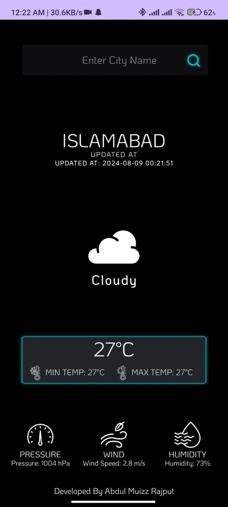
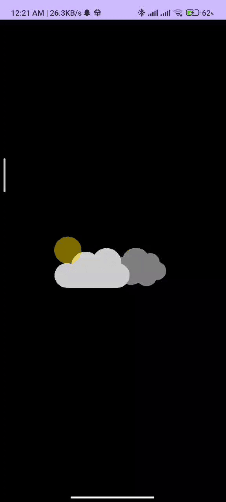

## Screenshots

Here is a screenshot of the project:





# Project Name

**Developed by:** Abdul Muizz Rajput  
**Get Design Idea by:** Dev-Aniketj  
**Coding by:** [Abdul Muizz Rajput ]

## Overview

This project is open source and available for free. You are encouraged to modify, enhance, and even resell this project. Contributions and improvements are welcome!

## Features

This is a simple project Using API of  (openweathermap.org)

## Getting Started

To get started with this project, follow these instructions:

1. **Clone the Repository**

    ```bash
    git clone https://github.com/abdulmuizzrajput/Weather_Application 
    ```

2. **IDE**

    Android Studio
   Target Api 34
   Minimum Api 24
   Fully Updated Libs
   Updated On 09/08/2024


## Contribution

If you have any ideas or suggestions related to this project, please leave a comment on the GitHub issue tracker, and we will consider implementing them. Feel free to fork the repository and submit a pull request.

## License

[license:  this project is distributed, MIT License]

## Contact

For freelance opportunities, please contact us:

- **Email:** [info@boppixel.in  or muizz7041@gmail.com]
- **LinkedIn:** [Profile Link](https://pk.linkedin.com/in/abdulmuizzrajput)

## Acknowledgements

- **Third-Party Images:** [Lottie Json File , CopyRight Free Graphics]

## Website

For more information about this project, visit our website: [Website Link](https://github.com/abdulmuizzrajput/website)

